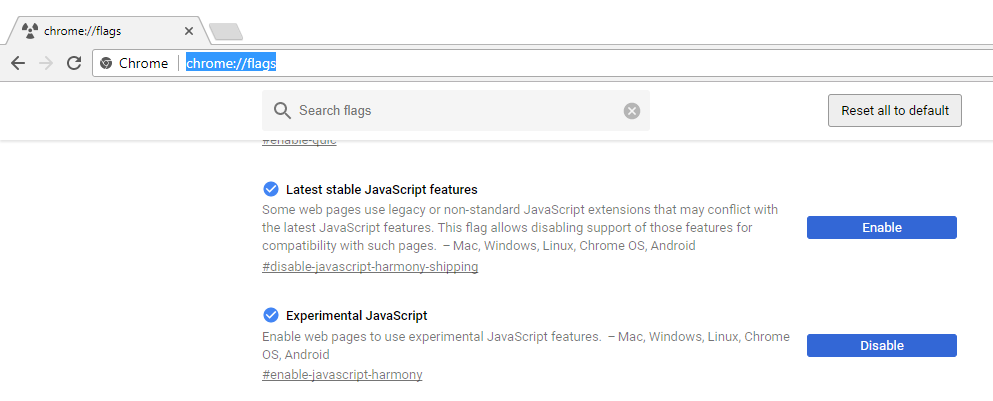
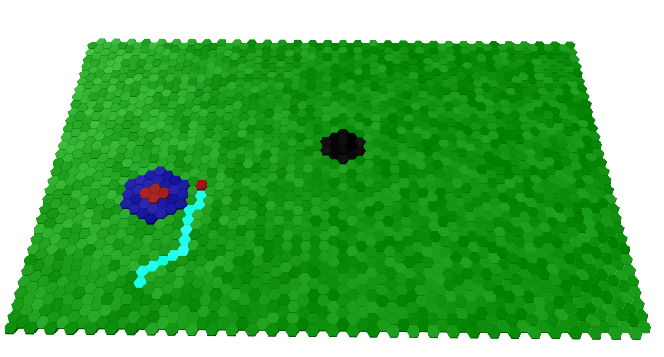

# 3D hex tile system

Refactoring of the excellent von-grid (https://github.com/vonWolfehaus/von-grid) by Corey Birnbaum

## Additional Features 

- Stacked Tiles 
- Hoovering
- Simple Animation 
	- selected tiles
	- path tiles
- Reactangular Grids
  


## Technical Difference
- Refactored to ECMA Script 2017, project can run without compiling in latest Chrome browser 
- Abstract Grid Base class 
- All files are now ECMA classes

#### Chrome Settings



#### Roadmap

- Renable Map Loading
- Make hoover and select work in same way, changing only color of top material
- 

## Usage

#### Basic board



```javascript

var scene = new Scene({
	element: document.getElementById('view'),
	cameraPosition: {x:0, y:150, z:150}
}, true);
var tileFactory = TF.RandomGreen;

var board = new Board();

var gridDef ={
	type:hex,
	cellSize:5,
	cellHeight:2,
	area:{rect:{width:64,height:32}},depth:3
}

board.configureGrid(gridDef);
board.createTiles(tileFactory,0);

scene.add(board.group);
scene.focusOn(board.group);

var mouse = new MouseCaster(board.tileGroup, scene.camera,document.getElementById("view"));
update();

function update() {
	mouse.update();
	scene.render();
	requestAnimationFrame(update);
}
```


## Editor

#### [Try it out](http://vonwolfehaus.github.io/von-grid/editor/)


